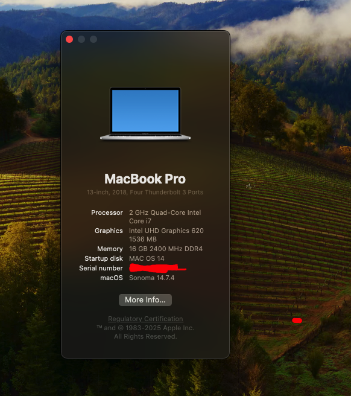

# EFI asus A442UF

- Intel i7-8550U
- Qualcomm Atheros QCA9377
- Codec Audio ALC256

## Works
- sonoma v14.7.2
- Bluetooth Ok
- No internal Wifi but ( using dongle tp-link acher T3u Plus) => Install https://github.com/chris1111/Wireless-USB-OC-Big-Sur-Adapter/releases/tag/V17 first
- Brightness Ok
- Keyboard Ok
- Hdmi Ok
- Ethernet Ok
- Audio Internal Ok
- Audio Jack 3,5 Ok
- Sleep/wake/restart Ok